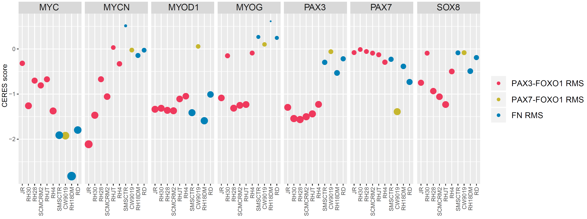
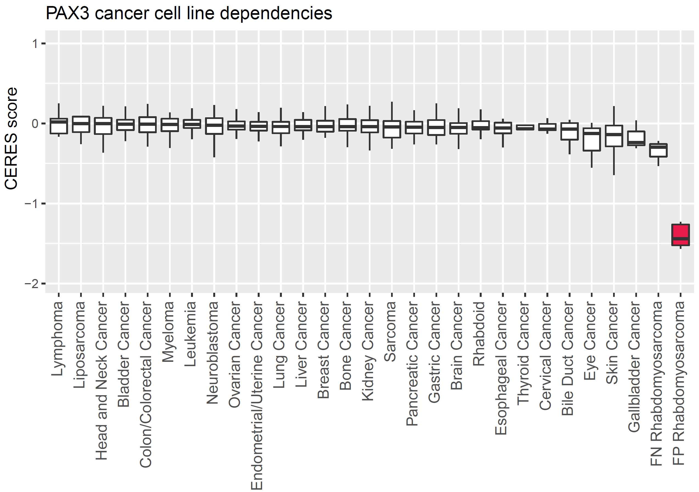
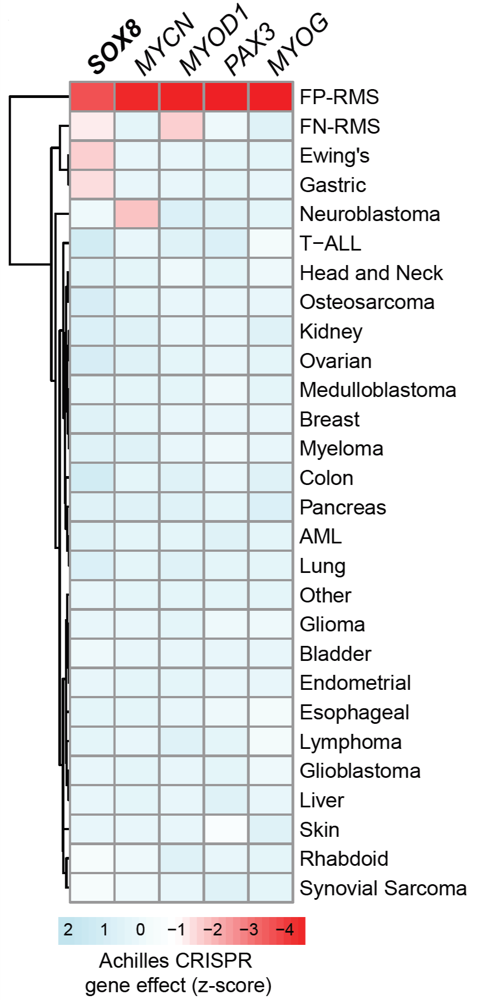

# CRISPRtoolkit
Code used to handle pooled CRISPR data (buildMatrix_and_plotCRISPR.R) and design followup sgRNAs by generating cutsite locations as BED coordinate (sgRNA_to_bed.sh).

# Achilles CRISPR data analysis script
R-script for analyzing and making figures (plotAchillesCRISPR_20Q1.R) from Achilles DepMap datasets. Updated to 20Q1.

Data freely available from:  https://depmap.org/portal/download/all/

1. CERES Rank dot plots 

2. Achilles ranked box plots per tumor type

3. Heatmap, genes vs. tumor types

